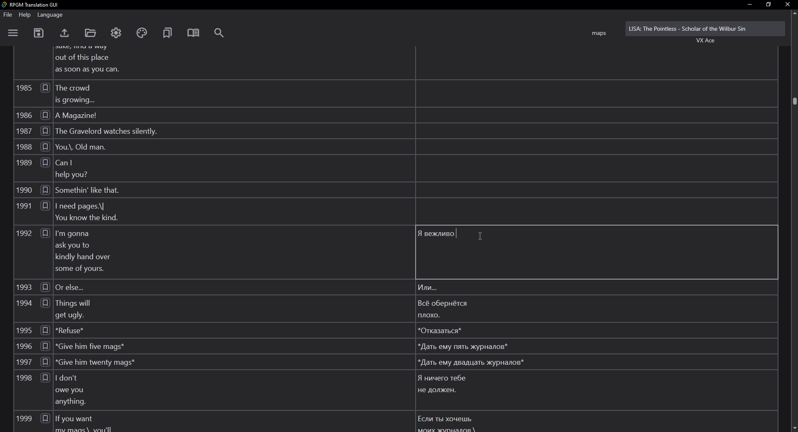

# rpgm-translation-gui

[README на русском](https://github.com/savannstm/rpgm-translation-gui/blob/main/README-ru.md)

## General

As the name says, this repository contains a graphical interface designed for editing and translating the text of games based on RPG Maker XP/VX/VXAce/MV/MZ engines.

The program is written using Rust and TypeScript, and the graphical interface is implemented using Tauri. Under the hood, this GUI uses [rvpacker-json-txt](https://github.com/savannstm/rvpacker-json-txt) to parse and write RPG Maker MV/MZ .json files, and [Rust implementation of Ruby Marshal](https://github.com/savannstm/marshal-rs) to parse and write RPG Maker XP/VX/VXAce files.
The program can open folders with games on the above-mentioned engines, and then parse the text of the games into .txt files from the source files located in the "data" folder.

In some cases, the source files of the XP/VX/VXAce games may be encrypted (in this case, generally, there is no data folder in the root directory of the game).

The graphical interface does not yet know how to handle such cases, and you will have to manually unpack the source files of games from an encrypted file using [RPG Maker Decrypter](https://github.com/uuksu/RPGMakerDecrypter).

If you have troubled figuring out the program, check the `Help > Help` top menu option. That will probably help.

**You can download the latest version from the Releases tab.**

## Manual building

Clone the repository:

`git clone https://github.com/savannstm/rpgm-translation-gui.git`.

cd to the `gui` directory and install all required Node.js dependencies:

`npm install`.

Run

`npm run tauri dev`,

to run the program in dev mode, or

`npm run tauri build`,

to build the program for your current OS.

You can edit frontend's program source code in `src` directory, and backend source code in `src-tauri/src` directory.

After the build, `target` directory will be created in the `gui/src-tauri` path, containing binary file with program build and distributable bundled packages in the `target/bundle` directory.

## License

The repository is licensed under [WTFPL](http://www.wtfpl.net/).
This means that you can use and modify the program in any way. You can do what the fuck you want to.
